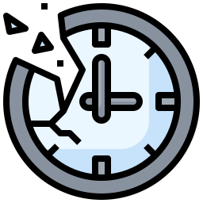

# 
Self-Taught Computer Science

  
<b>Time Invested So Far: 748h</b>

  
After years practicing different aspects of IT as a hobbyist, I've committed to studying and building a proper/well-rounded curriculum by teaching myself CS in-between work and my BSc. in Mech. Eng.

The repo is a place where I will log my learning process in an organized way, both for future reference and in the hopes that it can be useful to others.

## Contents

- [X] [Fundamentals](#fundamentals)
  - [X] [Intro CS](#intro-cs)
  - [X] [Math](#math)
- [X] [Core](#core)
  - [X] [Algorithms](#algorithms)
  - [X] [Programming](#programming)
  - [X] [Systems](#systems)
  - [X] [Security](#security)
  - [X] [Applications](#applications)
- [ ] [Advanced](#advanced)
  - [ ] [Programming](#advanced-programming)
  - [ ] [Systems](#advanced-systems)
  - [ ] [Security](#advanced-security)
  - [ ] [Theory](#advanced-theory)
- [X] [Specializations](#specializations)
  - [X] [Theory](#theory)
  - [X] [Languages](#languages)
  - [X] [Certifications](#certifications)

## Fundamentals
>
>Although nothing in this section was new to me, I decided some topics were worth revisiting. (Admittedly, was also a bit curious why these courses are so famous)

### Intro CS

| Progress | Type | Item | Start Date | End Date |
| :------: | :------: | ------ | :-------: | :-------: |
|| Course |Harvard's  [Introduction to Computer Science](https://www.edx.org/course/introduction-computer-science-harvardx-cs50x)|16-Aug-2021|16-Oct-2022|
|| Course | MIT's [The Missing Semester of Your CS Education](https://missing.csail.mit.edu/)|08-Nov-2022|18-Nov-2022|

### Math
>
>Lower priority since I've already studied this at university
>
| Progress | Type | Item | Start Date | End Date |
| :------: | :------: | ------ | :-------: | :-------: |
|| Course| MIT's [Calculus I A](https://openlearninglibrary.mit.edu/courses/course-v1:MITx+18.01.1x+2T2019/about), [B](https://openlearninglibrary.mit.edu/courses/course-v1:MITx+18.01.2x+3T2019/about) & [C](https://openlearninglibrary.mit.edu/courses/course-v1:MITx+18.01.3x+1T2020/about)|-|-|
|| Course|MIT's [Mathematics for CS](https://openlearninglibrary.mit.edu/courses/course-v1:OCW+6.042J+2T2019/about)|08-Nov-2022|08-Nov-2022|

## Core
>
>This is where most of my knowledge gaps were, mainly due to lack of formal education.

### Algorithms

| Progress | Type | Item | Project(s) | Start Date | End Date |
| :------: | :------: | ------ | :------------: | :-------: | :-------: |
|| Book| [Grokking Algorithms: An Illustrated Guide](https://www.amazon.com/Grokking-Algorithms-illustrated-programmers-curious/dp/1617292230)|  |03-Jul-2021|10-Jul-2021|
|| Course|Stanford's  [Algorithms Specialization](https://www.coursera.org/specializations/algorithms)|  |15-Aug-2023|02-Oct-2023|
|| Course|Princeton's  [Algorithms, Part I](https://www.coursera.org/learn/algorithms-part1)|[Link](homework/algorithms1)|02-Oct-2023|05-Dec-2023|
|| Course|Princeton's  [Algorithms, Part II](https://www.coursera.org/learn/algorithms-part2)|[Link](homework/algorithms2)|30-Nov-2023|14-Jan-2024|

### Programming

| Progress | Type | Item | Project(s) | Start Date | End Date |
| :------: | :------: | ------ | :------------: | :-------: | :-------: |
|| Book| [Head First Design Patterns](https://www.amazon.com/Head-First-Design-Patterns-Object-Oriented/dp/149207800X)|  |12-Aug-2021|20-Nov-2021|
|| Course| UBC's [How to Code Simple Data](https://www.edx.org/course/how-to-code-simple-data)|  |07-Jul-2022|28-Jul-2022|
|| Course| UBC's [How to Code Complex Data](https://www.edx.org/course/how-to-code-complex-data)|  |-|-|
|| Course| UW's [Programming Languages A](https://www.coursera.org/learn/programming-languages)|[Link](homework/programming-languages)|28-Jul-2022|01-Sep-2022|
|| Course| UW's [Programming Languages B](https://www.coursera.org/learn/programming-languages-part-b)|[Link](homework/programming-languages)|01-Sep-2022|13-Sep-2022|
| | Course| UW's [Programming Languages C](https://www.coursera.org/learn/programming-languages-part-c)|[Link](homework/programming-languages)|13-Sep-2022|05-Oct-2022|
| | Course| UAlberta's [Object-Oriented Design](https://www.coursera.org/learn/object-oriented-design)|  |05-Oct-2022|16-Oct-2022|
|| Course| UAlberta's [Design Patterns](https://www.coursera.org/learn/design-patterns)|  |16-Oct-2022|26-Oct-2022|
|| Course| UAlberta's [Software Architecture](https://www.coursera.org/learn/software-architecture)|  |02-Nov-2022|08-Nov-2022|
|| Course|[Design of Computer Programs](https://www.udacity.com/course/design-of-computer-programs--cs212)|  |||

### Systems

| Progress | Type | Item | Project(s) | Start Date | End Date |
| :------: | :------: | ------ | :------------: | :-------: | :-------: |
|| Course | HUJI's [From NAND To Tetris Pt1](https://www.coursera.org/course/nand2tetris1)|[Link](homework/nand2tetris)|18-Nov-2022|16-Dec-2022|
|| Course | HUJI's [From NAND To Tetris Pt2](https://www.coursera.org/learn/nand2tetris2)|[Link](homework/nand2tetris)|16-Dec-2022|03-Jan-2023|
|| Book| [Operating Systems: Three Easy Pieces](https://www.amazon.com/exec/obidos/ASIN/198508659X/) |[Link](homework/ostep)|13-Jan-2023|27-Jul-2023|
|| Book| [Computer Systems: A Programmer's Perspective](https://www.amazon.com/Computer-Systems-Programmers-Perspective-3rd/dp/013409266X) || ||
|| Course | UWisconsin's [Introduction to Operating Systems](https://pages.cs.wisc.edu/~remzi/Classes/537/Spring2018/) |[Link](homework/ostep)|13-Jan-2023|27-Jul-2023|
|| Course |Berkeley's [Great Ideas in Computer Architecture](https://inst.eecs.berkeley.edu/~cs61c/su21/) ||03-Aug-2023|14-Aug-2023|
|| Course |UMass's [Computer Networking: ATDA](http://gaia.cs.umass.edu/kurose_ross/online_lectures.htm) |[Link](homework/comp-networking)|28-Jul-2023|14-Aug-2023|

### Security

| Progress | Type | Item | Project(s) | Start Date | End Date |
| :------: | :------: | ------ | :------------: | :-------: | :-------: |
|| Course|[Cybersecurity Fundamentals](https://www.edx.org/course/cybersecurity-fundamentals)|  |30-Nov-2023|10-Dec-2023|
|| Course|[Principles of Secure Coding](https://www.coursera.org/learn/secure-coding-principles)|  |10-Dec-2023|22-Dec-2023|
|| Course|[Identifying Security Vulnerabilities](https://www.coursera.org/learn/identifying-security-vulnerabilities)|  |22-Dec-2023|07-Jan-2024|
|| Course|[Identifying Security Vulnerabilities in C/C++Programming](https://www.coursera.org/learn/identifying-security-vulnerabilities-c-programming)|  |07-Jan-2024|16-Jan-2024|

### Applications

| Progress | Type | Item | Project(s) | Start Date | End Date |
| :------: | :------: | ------ | :------------: | :-------: | :-------: |
|| Course|Stanford's [DBs: Modeling and Theory](https://www.edx.org/learn/databases/stanford-university-databases-modeling-and-theory)|  |16-Jan-2024|20-Jan-2024|
|| Course|Stanford's [DBs: Relational Databases and SQL](https://www.edx.org/learn/relational-databases/stanford-university-databases-relational-databases-and-sql)|  |20-Jan-2024|23-Jan-2024|
|| Course|Stanford's [DBs: Semistructured Data](https://www.edx.org/learn/relational-databases/stanford-university-databases-semistructured-data)|  |23-Jan-2024|24-Jan-2024|
|| Course|Stanford's [DBs: Advanced Topics in SQL](https://www.edx.org/learn/sql/stanford-university-databases-advanced-topics-in-sql)|  |25-Jan-2024|01-Feb-2024|
|| Course|Stanford's [DBs: OLAP and Recursion](https://www.edx.org/learn/databases/stanford-university-databases-olap-and-recursion)|  |01-Feb-2024|06-Feb-2024|
|| Course|Stanford's [Machine Learning Specialization](https://www.coursera.org/specializations/machine-learning-introduction)|  |04-Feb-2024|12-Feb-2024|
|| Course|UCSanDiego's [Computer Graphics](https://www.edx.org/learn/computer-graphics/the-university-of-california-san-diego-computer-graphics)|[Link](homework/computer-graphics)|12-Feb-2024|06-Mar-2024|
|| Course|IBM's [Introduction to Software Engineering](https://www.coursera.org/learn/introduction-to-software-engineering)|  |06-Mar-2024|08-Mar-2024|

## Advanced

### Advanced Programming

| Progress | Type | Item | Project(s) | Start Date | End Date |
| :------: | :------: | ------ | :------------: | :-------: | :-------: |
|| Course|[Software Debugging](https://www.youtube.com/playlist?list=PLAwxTw4SYaPkxK63TiT88oEe-AIBhr96A)|  |11-Mar-2024|19-Mar-2024|
|| Course|[Software Testing](https://www.youtube.com/playlist?list=PLAwxTw4SYaPkWVHeC_8aSIbSxE_NXI76g)|  |08-Mar-2024|11-Mar-2024|
|| Course|EPFL's [Parallel Programming](https://www.coursera.org/learn/scala-parallel-programming)|  |06-Jul-2024|20-Jul-2024|
|| Course|Stanfords's [Compilers](https://www.edx.org/course/compilers)|  |||
|| Course|UPenn's [Introduction to Haskell](https://www.seas.upenn.edu/~cis194/fall16/)|  |||
|| Course|[Learn Prolog Now!](https://www.let.rug.nl/bos/lpn//lpnpage.php?pageid=online)|  |||

### Advanced Systems

| Progress | Type | Item | Project(s) | Start Date | End Date |
| :------: | :------: | ------ | :------------: | :-------: | :-------: |
|| Course|MIT's [Computation Structures 1: Digital Circuits](https://learning.edx.org/course/course-v1:MITx+6.004.1x_3+3T2016) |  |||
|| Course|MIT's [Computation Structures 2: Computer Architecture](https://learning.edx.org/course/course-v1:MITx+6.004.2x+3T2015)|  |||
|| Course|MIT's [Computation Structures 3: Computer Organization](https://learning.edx.org/course/course-v1:MITx+6.004.3x_2+1T2017) |  |||

### Advanced Security

| Progress | Type | Item | Project(s) | Start Date | End Date |
| :------: | :------: | ------ | :------------: | :-------: | :-------: |
|| Course|KULeuven's [Web Security Fundamentals](https://www.edx.org/course/web-security-fundamentals) |  |||
|| Course|UCI's [Security Governance & Compliance](https://www.coursera.org/learn/security-governance-compliance) |  |||
|| Course|INFOSEC's [Digital Forensics Concepts](https://www.coursera.org/learn/digital-forensics-concepts) |  |||
|| Course|Linux Foundation's [Secure Software Development: Requirements, Design, and Reuse](https://www.edx.org/course/secure-software-development-requirements-design-and-reuse) |  |||
|| Course|Linux Foundation's [Secure Software Development: Implementation](https://www.edx.org/course/secure-software-development-implementation) |  |||
|| Course|Linux Foundation's [Secure Software Development: Verification and More Specialized Topics](https://www.edx.org/course/secure-software-development-verification-and-more-specialized-topics) |  |||

### Advanced Theory

| Progress | Type | Item | Project(s) | Start Date | End Date |
| :------: | :------: | ------ | :------------: | :-------: | :-------: |
|| Course|Stanfords's [Game Theory](https://www.coursera.org/learn/game-theory-1) |  |||

## Specializations

### Theory

| Progress | Type | Item | Project(s) | Start Date | End Date |
| :------: | :------: | ------ | :------------: | :-------: | :-------: |
|| Course | U. of Illinois's [Cloud Computing Specialization](https://www.coursera.org/specializations/cloud-computing) | |21-Nov-2024| |

### Languages

| Progress | Type | Item | Project(s) | Start Date | End Date |
| :------: | :------: | ------ | :------------: | :-------: | :-------: |
|| Book| Jens Gustedt's [Modern C](https://hal.inria.fr/hal-02383654/file/ModernC.pdf) |[Link](homework/modern-c)|04-Jan-2023|13-Jan-2023|
|| Learning Path| Pluralsight [Core Python](https://www.pluralsight.com/paths/core-python) ||13-May-2023|28-May-2023|
|| Book| [Intro to Web Applications Using ASP .Net Core MVC](https://link.springer.com/book/10.1007/978-3-031-30626-6) | |14-Nov-2023|04-Dec-2023|
|| Book| [C# 12 in a Nutshell](https://www.oreilly.com/library/view/c-12-in/9781098147433/) | |18-Mar-2024||

### Certifications

| Progress | Type | Certification | Code | Exam Date | Expiry Date |
| :------: | :------: | ------ | :------------: | :-------: | :-------: |
|| Azure | Microsoft Certified: [Azure Fundamentals](https://learn.microsoft.com/en-us/credentials/certifications/azure-fundamentals/?practice-assessment-type=certification) | AZ 900 |05-Jul-2024|N/A|
|| Azure | Microsoft Certified: [Azure Developer Associate](https://learn.microsoft.com/en-us/credentials/certifications/azure-developer/?practice-assessment-type=certification) | AZ 204 |19-Nov-2024|19-Nov-2025|
